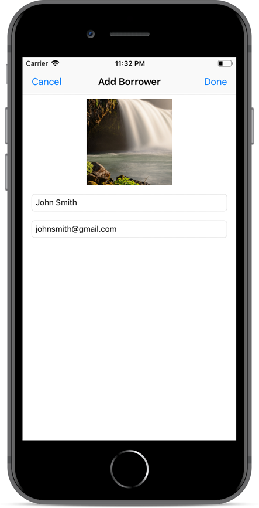

Borrowers
---
In Borrowers app user creates a list of  people that he/she lent something to. On the Borrower profile user adds personal data like mail address, phone number or even a photo. While clicking on Borrower profile a list of lent items appears. App uses CoreData to persist data.

* CoreData
* ImagePicker
* Alert
* Navigation Controller
* Collection View
* Custom View Cell
* Search Bar
* Toolbar

